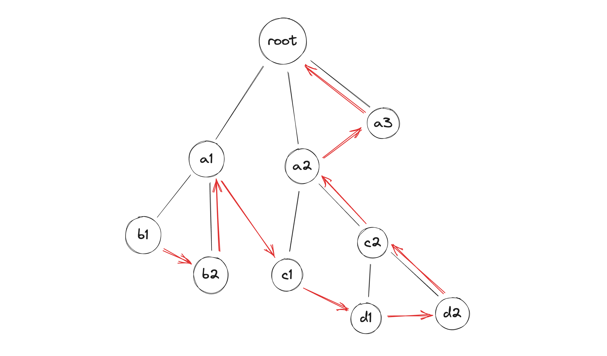

# flat-tree
Simple functions to build flat presentation of arbitrary tree and tests for it.

Flat presentation - array presentation of tree such that:
* all child nodes appear before their parent node
* every node contains children indexes

## Example
Nodes will be stored in following order


## Exported functions and types
```typescript
interface TreeNode<T= unknown> {
    value: T;
    children: TreeNode<T>[];
}

interface FlatNode<T = unknown> {
    value: T;
    children: number[];
}

type FlatPresentation<T> = FlatNode<T>[];

export declare const fromFlat: <T>(flat: FlatPresentation<T>) => TreeNode<T>;

export declare const toFlat: <T>(tree: TreeNode<T>) => FlatPresentation<T>;
```
